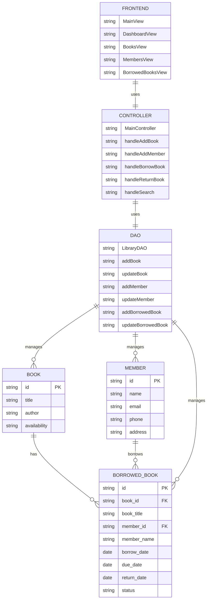

# Library Management System - Complete Architecture

## 1. Database Layer

### Book Entity
- **id**: Primary key, unique identifier for each book
- **title**: Title of the book
- **author**: Author of the book
- **availability**: Current availability status (Available/Borrowed)

### Member Entity
- **id**: Primary key, unique identifier for each member
- **name**: Full name of the member
- **email**: Email address of the member
- **phone**: Contact number of the member
- **address**: Physical address of the member

### BorrowedBook Entity
- **id**: Primary key, unique identifier for each borrowing record
- **book_id**: Foreign key referencing the Book entity
- **book_title**: Denormalized book title for quick access
- **member_id**: Foreign key referencing the Member entity
- **member_name**: Denormalized member name for quick access
- **borrow_date**: Date when the book was borrowed
- **due_date**: Date when the book is due for return
- **return_date**: Date when the book was returned (null if not returned)
- **status**: Current status (Borrowed/Returned/Overdue)

## 2. Application Layer

### Frontend Components (JavaFX)
1. **MainView**
   - Main application window
   - Navigation sidebar
   - Content area

2. **DashboardView**
   - Total books count
   - Total members count
   - Currently borrowed books count

3. **BooksView**
   - Books table
   - Add book button
   - Search functionality
   - Book management actions

4. **MembersView**
   - Members table
   - Add member button
   - Search functionality
   - Member management actions

5. **BorrowedBooksView**
   - Borrowed books table
   - Borrow book button
   - Search functionality
   - Return book actions

### Controller Layer
1. **MainController**
   - Handles navigation
   - Manages view switching
   - Coordinates between views

2. **Book Management**
   - handleAddBook()
   - handleSearchBooks()
   - handleUpdateBook()
   - handleDeleteBook()

3. **Member Management**
   - handleAddMember()
   - handleSearchMembers()
   - handleUpdateMember()
   - handleDeleteMember()

4. **Borrowing Management**
   - handleBorrowBook()
   - handleReturnBook()
   - handleSearchBorrowed()
   - handleUpdateBorrowedStatus()

### Data Access Layer (DAO)
1. **LibraryDAO**
   - Book operations
   - Member operations
   - Borrowing operations
   - Database connection management

## 3. Technology Stack

### Frontend
- JavaFX 17.0.2
- FXML for UI layout
- CSS for styling

### Backend
- Java 17
- MySQL 8.0
- JDBC for database connectivity

### Build Tools
- Maven 3.6+
- JavaFX Maven Plugin

## 4. Key Features
1. Book Management
   - Add/Edit/Delete books
   - Track book availability
   - Search books

2. Member Management
   - Register/Update/Remove members
   - Track member details
   - Search members

3. Borrowing Management
   - Issue books to members
   - Track due dates
   - Handle returns
   - Monitor overdue books

4. Dashboard
   - Real-time statistics
   - Quick access to key functions
   - System overview

## 5. Database Relationships
1. Book to BorrowedBook (1:N)
   - One book can be borrowed multiple times
   - Each borrowed record references one book

2. Member to BorrowedBook (1:N)
   - One member can borrow multiple books
   - Each borrowed record references one member 